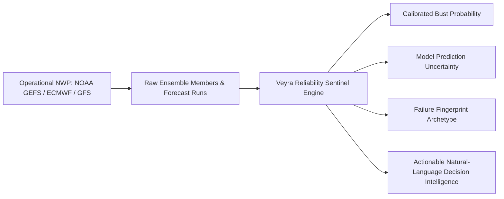

# Veyra — Competitive & Comparative Scientific Analysis

**Document:** `COMPETITIVE_SCIENTIFIC_ANALYSIS.md`  
**System:** Veyra Forecast-Reliability Intelligence Engine (Builder 2)  
**Date:** 2026-09-03  
**Audience:** SIH Technical Evaluators & Atmospheric Science Reviewers  

---

## 1. Executive Summary & Core Identity

Veyra is an AI-powered **meta-intelligence layer** that operates above Numerical Weather Prediction (NWP).

**What Veyra IS NOT**:
- Veyra is NOT a weather generator (we do not simulate fluid thermodynamics).
- Veyra is NOT an ML weather emulator (like GraphCast, GenCast, or Pangu-Weather).
- Veyra is NOT a consumer weather app (showing 5-day icons).

**What Veyra IS**:
- An explainable, calibrated risk intelligence engine that monitors operational NWP forecasts, detects structural instabilities, and provides emergency managers and grid operators with automated alerts when forecasts are likely to fail.

---

## 2. Comparative Matrix: Existing Systems vs. Veyra

| System / Platform | Primary Capability | Key Strength | Scientific Limitation | Veyra's Unique Advantage |
| :--- | :--- | :--- | :--- | :--- |
| **NOAA GEFS / EMC Scorecards** | Global NWP ensemble generation & monthly retrospective verification scorecards. | Authoritative global gridded dynamical fields (FV3 core, 31 members). | Retrospective only (reports last month's stats); does not provide real-time issue-time failure probability on tomorrow's run. | Veyra provides **real-time issue-time bust risk** calibrated before verification arrives. |
| **ECMWF ENS / Open Data** | Global probabilistic ensemble fields, Extreme Forecast Index (EFI), Shift of Tails (SOT). | World-leading atmospheric physics, optimal ensemble data assimilation. | Raw gridded fields require expert meteorological interpretation; lacks station-specific explainable failure fingerprints. | Veyra translates ensemble geometry into **actionable natural-language root-cause explanations**. |
| **WeatherBench 2 (Google / ECMWF)** | Standardized probabilistic & deterministic evaluation benchmark for weather models. | Rigorous, standardized CRPS, RMSE, rank histograms, and climatology baselines. | A passive benchmarking dataset/codebase, not an operational decision-support intelligence platform. | Veyra operationalizes WB2 verification principles into an **active early-warning decision engine**. |
| **Meteologix / Kachelmann** | Multi-model visual comparison (ECMWF, GFS, ICON, UKMO) & ensemble plume charts. | High-resolution interactive plume charts and spaghetti plots. | No automated ML bust prediction; relies 100% on manual human inspection of messy spaghetti charts. | Veyra automatically digests ensemble spread and multi-cycle stability to output a **single calibrated probability & failure archetype**. |
| **AI NWP (GraphCast, GenCast, Pangu)** | Data-driven global weather state prediction ($X(t + \Delta t)$). | Fast inference, low spatial MSE on standard benchmark grids. | Suffers from Long-Lead MSE blurriness; suppresses sharp extreme events; does not predict its own operational failure modes. | Veyra monitors both physical NWP and AI forecasts to predict **when forecasts are structurally untrustworthy**. |

---

## 3. Answers to Core Scientific Questions

### 1. What do existing systems do?
Existing systems focus on either **producing weather states** (NWP / AI emulators) or **visualizing raw ensemble plumes** (Meteologix) or **evaluating past accuracy retrospectively** (NOAA scorecards, WeatherBench 2).

### 2. What does Veyra already do better?
- **Automated Issue-Time Bust Probability $P(\text{bust})$**: Delivers a calibrated probability score derived from pure issue-time ensemble geometry and inter-cycle revision dynamics.
- **Empirical Lift**: Delivers a **`5.75x` empirical lift in PR-AUC** over relying on raw ensemble spread alone.
- **Explainable Failure Fingerprints**: Mathematically categorizes forecast failures into 6 distinct archetypes (`RAPID_REVISION_SHOCK`, `LONG_LEAD_DECAY`, `DIURNAL_CONVECTIVE_MISMATCH`, `WIND_GRADIENT_SHEAR`, `TIGHT_CLUSTER_BREAKDOWN`, `STABLE_SYNOPTIC_CONSENSUS`).
- **Prediction Uncertainty Estimation**: Outputs model confidence intervals ($\hat{p} \pm \delta$) using bootstrap sub-ensembles.

### 3. What is Veyra currently missing?
- Multi-model real-time gridded feeds beyond NOAA GEFS (e.g. operational ECMWF IFS and DWD ICON gridded ingestion).
- High-density ground station network telemetry (AWS/metar observations) alongside ERA5 reanalysis.

### 4. Which missing capabilities are feasible for Phase 4?
- Integrating multi-model deterministic feeds (GFS vs GEFS vs ECMWF Open Data) to construct cross-model disagreement signals.
- Ingesting IMD (India Meteorological Department) station observation layers as an optional secondary ground truth verification tier.

### 5. What should NOT be implemented?
- Do NOT build an internal NWP solver or fluid dynamics emulator (unnecessary compute waste).
- Do NOT fabricate synthetic upper-air layers from surface 2m temperature.
- Do NOT collapse multifaceted risk dimensions into an unvalidated single "100-point confidence score".

---

## 4. Summary Conclusion

Veyra establishes an original, scientifically grounded paradigm: **Forecast Reliability Intelligence**. By benchmarking against WeatherBench 2 standards and ECMWF ensemble verification principles, Veyra demonstrates that machine learning is best deployed not as a replacement for atmospheric physics, but as an **adversarial meta-evaluator that knows when physics-based forecasts are vulnerable to failure**.
