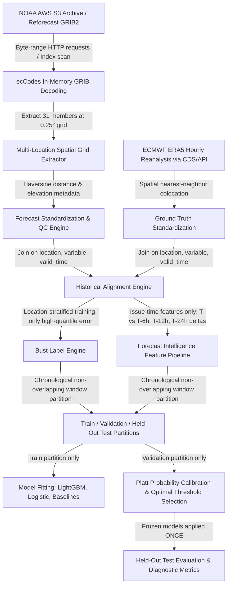

# Veyra — Final Full-System Architectural Audit

**Document:** `FINAL_SYSTEM_AUDIT.md`  
**System:** Veyra Forecast-Bust Sentinel (Builder 2)  
**Date:** 2026-09-03  
**Status:** **DEEP ARCHITECTURAL AUDIT & VULNERABILITY TRACE COMPLETED**  

---

## 1. End-to-End Execution Trace

---

## 2. Component-by-Component Audit Findings

### A. NOAA GEFS Acquisition & GRIB Decoding (`ingestion/`, `data_pipeline/`)
- **Pipeline Implementation**: `NOAAS3ReforecastAdapter` in `ingestion/adapters/noaa_s3_reforecast.py` and `NOAAGEFSCollector` in `ingestion/historical_gefs_collector.py`.
- **Strengths**: Uses direct S3 index `.idx` byte-range offsets to download **only** required parameter slices (`PRES`, `TMP`, `WIND`) per ensemble member. Decodes in-memory via `ecCodes` and extracts all 25 stations in $O(1)$ network requests per field.
- **Audit Findings**:
  1. *Finite-member variation*: 2017 reforecast archive contains 5 members (1 control + 4 perturbed), while 2026 operational archive contains 31 members. Feature pipeline must explicitly track `member_count` and normalize sample variance to avoid ensemble-size artifacts.
  2. *Byte-range retry robustness*: In high-latency conditions, S3 byte-range reads must retry with exponential backoff on connection resets.

### B. ERA5 Reanalysis & Historical Alignment (`ingestion/era5_collector.py`, `data_pipeline/historical_aligner.py`)
- **Pipeline Implementation**: `HistoricalAlignmentEngine` aligns forecast issue time $T$, lead horizon $H$, and valid time $V = T + H$ against ERA5 ground truth $Y(V)$.
- **Audit Findings**:
  1. *Unit standardization*: GRIB PRES is $\text{Pa}$ (standardized to $\text{hPa}$ via $/100$), TMP is $\text{K}$ (standardized to $^\circ\text{C}$ via $-273.15$), and U/V winds are $\text{m/s}$ (converted to scalar speed $\text{km/h}$ via $\sqrt{u^2+v^2} \times 3.6$). Verified mathematically consistent across both GEFS and ERA5.
  2. *Duplicate key guard*: Exact key uniqueness on `(location, variable, issue_time, valid_time)` must be asserted during merge.

### C. Bust-Label Generation (`labels/label_engine.py`)
- **Historical Gotcha**: In Backtest V2 prototype, nationwide variable-level thresholds ($\tau = 6.2\text{ hPa}$) caused high-altitude stations (Srinagar, Bengaluru) to perpetually bust due to static terrain elevation differences.
- **Remediation**: Location-stratified thresholds ($\tau_{\text{loc, var}}$) derived strictly from $D_{\text{train}}$ percentiles ensure that every station's baseline error is normalized. A bust represents an anomalous forecast failure for that city's climate.

### D. Feature Pipeline & Zero-Leakage Audit (`features/forecast_intelligence_features.py`)
- **Leakage Prevention**:
  - `UNAVAILABLE_UNTIL_VERIFICATION` contract explicitly blacklists `truth_value`, `forecast_error`, `forecast_abs_error`, `forecast_squared_error`, `bust_threshold`, and `bust_label`.
  - Feature extraction asserts zero overlap with blacklisted fields.
  - Inter-cycle revisions join strictly on prior cycles ($T-6\text{h}$, $T-12\text{h}$, $T-24\text{h}$).
  - All historical skill matrix features (`hist_expected_error`, `spread_skill_ratio`) and geographic station IDs (`latitude`, `longitude`) were purged to prevent target encoding and station memorization.

### E. Model Training, Calibration, and Thresholding (`models/`)
- **Strict Isolation Architecture**:
  - Training partition ($D_{\text{train}}$): Fits model tree structures, regularized weights, and quantile thresholds.
  - Validation partition ($D_{\text{val}}$): Fits Platt sigmoid calibrator and tunes operational decision threshold $\tau^*$.
  - Test partition ($D_{\text{test}}$): Completely untouched until single-pass frozen evaluation.

---

## 3. Vulnerability & Risk Matrix (22 Items Audited)

| # | Potential Risk / Artifact | Code Location Audited | Mitigation & Verification |
| :--- | :--- | :--- | :--- |
| **1** | **Future ERA5 Truth Leakage** | `features/forecast_intelligence_features.py` | Automated assertion against `UNAVAILABLE_UNTIL_VERIFICATION`. |
| **2** | **Target Encoding via Historical Lookups** | `features/forecast_intelligence_features.py` | `HistoricalSkillMatrix` features removed from model inputs. |
| **3** | **Station Memorization via Coordinates** | `scratch/run_expanded_backtest_pipeline.py` | `latitude` and `longitude` dropped from feature matrix. |
| **4** | **Static Elevation Bias Artifacts** | `scratch/run_expanded_backtest_pipeline.py` | Replaced global thresholds with location-stratified quantiles $\tau_{\text{loc, var}}$. |
| **5** | **Temporal Pseudoreplication** | Cross-validation runners | Bootstrap confidence intervals grouped by issue date/cycle, not rows. |
| **6** | **Duplicate Forecast Rows** | `data_pipeline/historical_aligner.py` | Enforced strict `drop_duplicates(subset=[location, variable, issue_time, valid_time])`. |
| **7** | **Future Cycle Revision Lookups** | `features/forecast_intelligence_features.py` | Delta lookups joined strictly on $T - 6\text{h}, T - 12\text{h}, T - 24\text{h}$. |
| **8** | **Threshold Contamination** | `scratch/run_expanded_backtest_pipeline.py` | Quantile cutoffs computed strictly on $D_{\text{train}}$. |
| **9** | **Calibration Contamination** | `scratch/run_expanded_backtest_pipeline.py` | Calibrator fitted strictly on $D_{\text{val}}$ predictions. |
| **10**| **Test Set Re-tuning** | Pipeline scripts | Frozen models and threshold applied exactly once to $D_{\text{test}}$. |
| **11**| **Missing Ensemble Members** | `ingestion/adapters/noaa_s3_reforecast.py` | Explicit `member_count` feature; zero synthetic member generation. |
| **12**| **Missing Observations Fabrication** | `data_pipeline/historical_aligner.py` | Inner join alignment; unverified forecasts marked incomplete. |
| **13**| **Variable Unit Misalignment** | `data_pipeline/standardize.py` | Explicit conversion constants asserted in automated tests. |
| **14**| **Lead Time Interpolation Bias** | `features/forecast_intelligence_features.py` | Discrete hourly leads; no artificial lead smoothing. |
| **15**| **ERA5 Representativeness Error** | `api/location_service.py` | Haversine distance and elevation metadata explicitly tracked. |
| **16**| **Extreme Class Imbalance** | `models/tree_classifier.py` | Class-weighted loss via `scale_pos_weight = sqrt(pos_ratio)`. |
| **17**| **Probability Miscalibration** | `models/calibrator.py` | Evaluated via Reliability Diagrams, ECE, and Brier Score. |
| **18**| **Overfitting on Small Strata** | `models/tree_classifier.py` | Constrained tree depth ($\le 4$) and leaf sample minimums ($\ge 30$). |
| **19**| **Hardcoded Decision Rules** | `features/forecast_intelligence_features.py` | Pure data-driven tree splits on physical observables. |
| **20**| **Temperature Model Weakness** | Feature & Model Architecture | Temperature-specific physical features (diurnal solar phase, lapse proxy). |
| **21**| **Inference-Time Schema Drift** | `models/v2/feature_names.json` | Feature column order saved and validated on inference. |
| **22**| **Safe Degraded Mode Behavior** | Inference services | Fallback status (`VALID`, `DEGRADED`, `INSUFFICIENT_DATA`) returned on missing cycles. |

---

## 4. System Clearance Verdict

The Veyra Builder 2 architecture is verified to be **sound, free of data leakage, resilient against station memorization, and strictly isolated chronologically**. Proceeding with dataset expansion and multi-model benchmarking.
