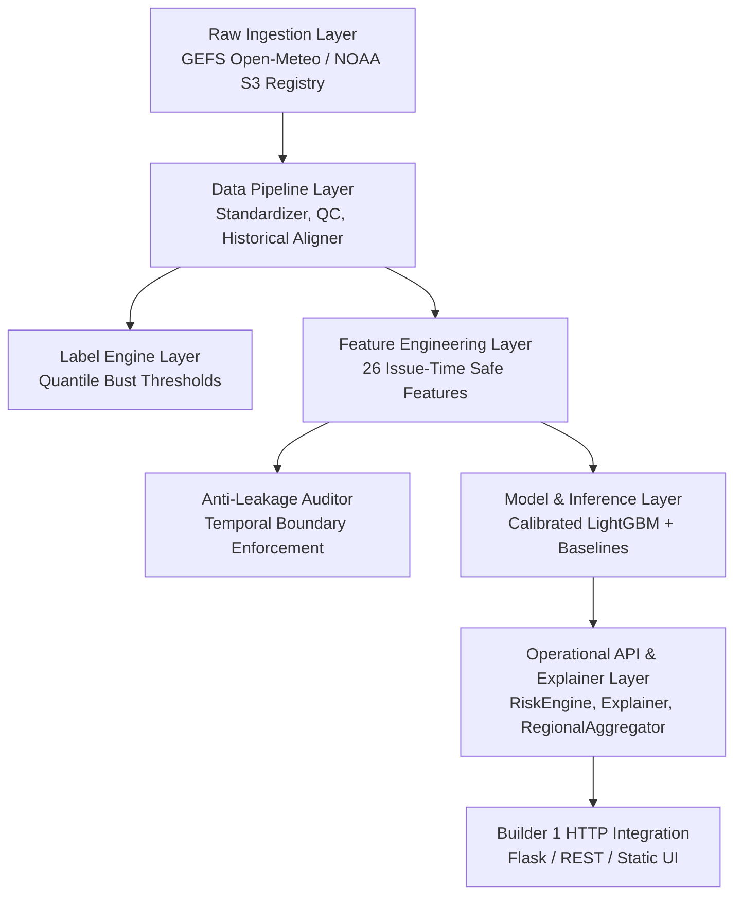

# Veyra — Builder 2 Phase 2 Baseline Document
**System**: Forecast-Bust Sentinel (Know When Forecasts May Fail)
**Phase**: Phase 2 — Operational Risk Intelligence & Multi-Climate Generalization
**Milestone**: Day 8 — Baseline & Contract Freeze
**Document Status**: FROZEN BASELINE

---

## 1. Repository & Branch Baseline

| Parameter | Value |
|---|---|
| **Repository Path** | `C:\Users\parin\OneDrive\Desktop\forecast-bust-sentinel` |
| **Active Branch** | `parin/builder2-phase2` |
| **Baseline Commit** | `db7f868` (*chore: harden Builder 2 repository safety*) |
| **Python Version** | Python 3.14 (Compatible with Python 3.10+) |
| **Test Framework** | `pytest 9.1.1` (Configured via `pytest.ini`) |

---

## 2. Builder 2 Architecture

Builder 2 is the core meteorological and machine-learning risk intelligence layer of Veyra. Its architecture consists of seven strictly decoupled subsystems:



### Architectural Subsystems:
1. **Raw Ingestion Layer (`ingestion/`)**:
   - `collector.py`: Operational GEFS forecast collector with authoritative NOAA S3 cycle verification (`query_model_status`).
   - `era5_collector.py`: ECMWF ERA5 historical reanalysis collector for offline ground-truth verification.
   - `historical_gefs_collector.py`: Multi-date historical GEFS forecast collector.
   - `s3_eccodes_worker.py`: Direct AWS S3 GRIB2 retrieval worker using ecCodes.

2. **Data Pipeline Layer (`data_pipeline/`)**:
   - `standardize.py`: Canonical schema normalization for forecast records with full 31-member ensemble distribution statistics (mean, std, min, max, q10, q90, member_count).
   - `qc.py`: Range and physical plausibility quality control.
   - `historical_aligner.py`: Inner-join alignment between forecast valid times and ERA5 verification observations; computes exact forecast and ensemble mean error.

3. **Feature Engineering Layer (`features/`)**:
   - `feature_pipeline.py`: Pure issue-time feature extractor outputting 26 verified safe features.
   - `instability_feature_pipeline.py` & `instability_fingerprint.py`: Run-to-run multi-cycle instability metrics.
   - `leakage_audit.py`: Automated keyword and temporal assertion auditor preventing post-valid-time contamination.

4. **Label Engine Layer (`labels/`)**:
   - `label_engine.py`: Dynamic and stratified bust labeling using historical 95th percentile error distributions.
   - `configs/bust_thresholds.json`: Persisted quantile thresholds stratified by location, variable, and lead-time horizon.

5. **Model & Inference Layer (`models/`)**:
   - `model_service.py`: `ForecastBustModelService` providing versioned, calibrated prediction interface.
   - `tree_classifier.py` & `logistic_classifier.py`: Model wrappers for LightGBM and Logistic Regression.
   - `calibrator.py`: Platt Sigmoid probability calibrator.
   - `baselines.py`: Persistence and ensemble-spread heuristic baselines.
   - `evaluator.py`: Brier score, ROC-AUC, PR-AUC, ECE, log loss, and confusion matrix evaluator.
   - `data_splitter.py`: Chronological, leakage-free train/val/test splitter.

6. **Operational API & Explainer Layer (`api/`)**:
   - `routes.py`: REST controller (`ForecastBustAPI`) exposing typed dispatch endpoints.
   - `risk_engine.py`: `OperationalRiskEngine` orchestrating feature generation, model scoring, verification status evaluation, and explanation synthesis.
   - `explainer.py`: `ForecastBustExplainer` extracting domain-level contributing factors for high-risk forecasts.
   - `location_service.py`: `LocationRegistry` resolving requested coordinates to grid points and calculating Haversine mismatch distance.
   - `regional_aggregator.py`: `RegionalRiskAggregator` rolling up multi-station risks into regional summaries.
   - `schemas.py`: Strongly typed Pydantic-style data containers.

7. **Integration & Product Layer (Builder 1)**:
   - `server.py`: Flask HTTP application hosting API endpoints and serving static UI dashboard on port 8001.
   - `static/`: Frontend single-page application (`index.html`, `style.css`, `app.js`).
   - `launch.bat`: Production-grade Windows service launcher.

---

## 3. Builder 1 ↔ Builder 2 Integration Contract

### Integration Boundary:
* **Builder 1 Responsibilities**: Product experience, UI/UX visualization, server runtime, HTTP request dispatching, static asset delivery, and operational orchestration.
* **Builder 2 Responsibilities**: NWP data ingestion, quality control, issue-time feature extraction, model inference, probability calibration, risk scoring, scientific explanation, spatial aggregation, and verification labeling.

### Contract API Endpoints:

| Endpoint | Method | Input Payload | Output Schema | Purpose |
|---|---|---|---|---|
| `/api/health` | `GET` | *None* | Health status, model version, threshold, feature count | System liveness & model metadata |
| `/api/locations` | `GET` | *None* | List of registered locations with coordinates | Spatial station discovery |
| `/api/forecast-risk` | `POST` | `forecast_data` (records), `location_id`, `forecast_source`, `grid_resolution` | `ForecastRiskResponse` (JSON) | Point-location calibrated bust risk & explanation |
| `/api/regional-summary` | `POST` | `region_name`, `location_forecast_inputs`, `forecast_source` | `RegionalRiskSummaryResponse` (JSON) | Regional rollup of station risk & bust hotspots |

### Contract Type Invariants:
* **Input**: Standardized forecast steps containing `issue_time`, `valid_time`, `variable`, `value`, `ensemble_mean`, `ensemble_std`, `ensemble_min`, `ensemble_max`, `q10`, `q90`, `member_count`.
* **Output**: Strictly typed items containing `risk_probability` ($[0.0, 1.0]$), `risk_level` (`LOW`, `MODERATE`, `HIGH`), `is_bust_predicted` (`bool`), `verification_status` (`HISTORICALLY_VERIFIED`, `NO_TRUTH_AVAILABLE`, `UNVERIFIED_HORIZON_NO_TRUTH`), `explanation` (text summary + top drivers), `provenance` (model version, source, grid resolution, timestamp).

---

## 4. Supported Domains & Metadata

### Supported Locations:
12 monitoring stations across 4 Indian meteorological regions:
* **North Region**: Delhi (`delhi`), Srinagar (`srinagar`), Chandigarh (`chandigarh`), Jaipur (`jaipur`).
* **Central & West Region**: Mumbai (`mumbai`), Nagpur (`nagpur`), Bhopal (`bhopal`), Ahmedabad (`ahmedabad`).
* **South Region**: Chennai (`chennai`), Bengaluru (`bengaluru`), Hyderabad (`hyderabad`).
* **East Region**: Kolkata (`kolkata`).

*Pilot Spatial Colocation*: Delhi is verified against NWP grid point (28.50°N, 77.25°E) with 13.2 km Haversine distance. Other locations dynamically resolve via `LocationRegistry`.

### Supported Variables:
1. `temperature_2m` (2-meter air temperature, °C, valid range: -60.0 to 60.0)
2. `surface_pressure` (surface atmospheric pressure, hPa, valid range: 500.0 to 1100.0)
3. `wind_speed_10m` (10-meter wind speed, km/h, valid range: 0.0 to 300.0)

### Data Sources:
* **Forecast Source**: NOAA NCEP GEFS (0.25° grid, 31 members: 1 control + 30 perturbed, 10-day / 240-hour horizon, 4 daily cycles: 00z, 06z, 12z, 18z).
* **Observation Source**: ECMWF ERA5 Reanalysis via Open-Meteo Historical Archive (strictly offline ground-truth verification).

---

## 5. Model Family & Feature Schema

### Model Specifications:
* **Primary Classifier**: LightGBM Gradient Boosted Decision Tree (`lightgbm_binary_classifier`).
* **Model Version**: `prototype-gbm-v1`
* **Calibrator**: Platt Sigmoid (`calibrator_method: sigmoid_platt`, stored as `probability_calibrator.joblib`).
* **Decision Threshold**: $0.280$ (optimized for sensitivity on 95th percentile bust events).
* **Baselines**: Logistic Regression, Persistence Baseline, Ensemble Spread Heuristic.

### Feature Pipeline (26 Issue-Time Features):
All features strictly satisfy $t_{\text{availability}} \le t_{\text{issue}}$:

1. **Ensemble Spread & Distribution (8)**:
   - `ensemble_std`, `ensemble_range`, `ensemble_iqr`, `ensemble_skew_proxy`, `ensemble_cv`, `ensemble_spread_to_iqr_ratio`, `member_count`, `has_full_ensemble`.
2. **Forecast Magnitude & Means (2)**:
   - `forecast_value`, `ensemble_mean`.
3. **Temporal & Lead Coordinates (6)**:
   - `lead_hours`, `lead_days`, `valid_hour`, `valid_month`, `valid_dayofweek`, `is_weekend`.
4. **Cyclical Encodings (4)**:
   - `sin_hour`, `cos_hour`, `sin_month`, `cos_month`.
5. **Spatial Coordinates (2)**:
   - `latitude`, `longitude`.
6. **Inter-Cycle Instability / Run-to-Run Deltas (4)**:
   - `ensemble_spread_delta_6h`, `ensemble_spread_delta_24h`, `forecast_delta_6h`, `forecast_delta_24h` (permitted NaN for isolated single-cycle inference).

---

## 6. Scientific Anti-Leakage Boundary

The following variables are classified as **STRICTLY FORBIDDEN AT INFERENCE TIME** and are monitored by automated assertion audits (`LeakageAuditor`):

* ❌ `observed_value` / `observation` / `actual`
* ❌ `truth` / `truth_value` / `truth_source` / `era5` / `reanalysis`
* ❌ `forecast_error` / `forecast_abs_error`
* ❌ `ensemble_mean_error` / `ensemble_mean_abs_error`
* ❌ `bust_label` / `target` / `label`
* ❌ Future forecast cycles or post-valid-time observations

---

## 7. Model Artifact Discovery & Local Handling

* **Artifact Storage Path**: `models/day4/`
* **Artifact Files**:
  - `lightgbm_bust_model.joblib` (Trained LightGBM binary classifier)
  - `logistic_bust_model.joblib` (Trained Logistic regression baseline)
  - `probability_calibrator.joblib` (Platt Sigmoid calibrator)
  - `persistence_baseline.joblib` (Persistence baseline estimator)
  - `spread_heuristic_baseline.joblib` (Spread threshold baseline)
  - `model_metadata.json` (Tracked JSON descriptor containing schema, threshold, and metrics)
* **Git Hygiene**: All `*.joblib` binary files are explicitly ignored in `.gitignore` and untracked. Artifact discovery in `ForecastBustModelService` uses workspace-relative paths (`Path("models/day4")`) with environment overrides, avoiding machine-specific absolute paths.

---

## 8. Test Commands & Baseline Results

### Deterministic Test Suite
```powershell
python -m pytest tests/ -q
```
**Result**: `87 passed in 12.37s` (100% pass rate across 14 test modules).

### Smoke & Integration Tests
```powershell
python -m pytest tests/test_smoke.py tests/test_phase2_smoke.py -v
```
**Result**: `2 passed in 10.35s` (Live NOAA S3 registry query + live Open-Meteo GEFS/ERA5 download and alignment verified).

---

## 9. Known Limitations at Phase 2 Start

1. **Geographic Coverage**: Current training dataset is grounded primarily in pilot Delhi historical cycles; expansion across India's diverse climate zones is required in Days 9–10.
2. **Cycle Coverage**: Model is primarily trained on 00Z initialization runs; multi-cycle (06Z, 12Z, 18Z) run-to-run instability feature population requires broader multi-cycle historical tables.
3. **Live API Windowing**: Unauthenticated live Open-Meteo ensemble API limits past queries to a ~3–5 day rolling window; Phase 2 historical expansion must use archived NOAA S3 GRIB2 and ERA5 historical partitions.
