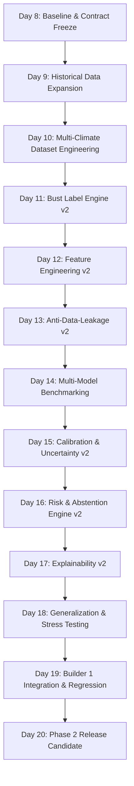

# Veyra — Builder 2 Phase 2 Execution Plan
**System**: Forecast-Bust Sentinel (Know When Forecasts May Fail)
**Phase**: Phase 2 — Operational Risk Intelligence & Multi-Climate Generalization
**Plan Horizon**: Days 8 through 20
**Status**: APPROVED EXECUTION ROADMAP

---

## 1. Implementation Principles & Sequencing

Phase 2 advances Builder 2 from a pilot single-station prototype into an enterprise-grade, multi-climate forecast risk intelligence engine. Every component is developed according to a strict scientific dependency order:

---

## 2. Day-by-Day Milestone Breakdown

### Day 8 — Baseline & Contract Freeze
* **Objective**: Establish the known-good Phase 1 baseline, lock the Builder 1 ↔ Builder 2 integration contract, and verify test and model safety.
* **Deliverables**:
  - `docs/phase-2/BASELINE.md`
  - `docs/phase-2/BUILDER_2_PHASE2_PLAN.md`
  - Fixed live smoke test with relative UTC date windowing.
  - Complete 87-test suite pass verification.
* **Acceptance Criteria**:
  - 100% test pass rate across unit, integration, and smoke tests.
  - Zero model binary leaks in git.
  - Builder 1 files intact and unmodified.
* **Dependencies**: Phase 1 codebase.

---

### Day 9 — Historical Data Expansion
* **Objective**: Ingest multi-year historical NOAA GEFS ensemble forecasts and paired ECMWF ERA5 reanalysis truth across target pilot stations.
* **Deliverables**:
  - Scalable batch historical ingestion pipeline with NOAA S3 / Open-Meteo archive workers.
  - Automated download validation and checksum auditing.
  - Raw partitioned Parquet storage in `data/historical/`.
* **Acceptance Criteria**:
  - Ingestion of at least 1–2 years of continuous daily GEFS cycles (00z, 06z, 12z, 18z).
  - 100% paired verification alignment between valid times and ERA5 observations.
* **Dependencies**: Day 8 baseline.

---

### Day 10 — Multi-Climate Dataset Engineering
* **Objective**: Expand geographic dataset coverage across India’s core Köppen climate zones (Tropical Wet, Semi-Arid, Mountain/Alpine, Subtropical Humid).
* **Deliverables**:
  - Climate zone mapping in `LocationRegistry`.
  - Balanced multi-station training dataset generator.
  - Outlier filtering, QC, and sensor plausibility auditing.
* **Acceptance Criteria**:
  - Minimum 6 diverse meteorological stations represented across North, South, Central/West, and East India.
  - Zero unverified grid coordinates in training sets.
* **Dependencies**: Day 9 historical data.

---

### Day 11 — Bust Label Engine v2
* **Objective**: Upgrade the bust label engine to support multi-variable, lead-dependent, and extreme-error definitions.
* **Deliverables**:
  - Stratified quantile thresholding (90th, 95th, 97.5th, 99th percentiles) per station, variable, and forecast horizon.
  - Compound bust definitions (joint temperature-wind-pressure failures).
  - Updated `configs/bust_thresholds.json` with multi-climate distributions.
* **Acceptance Criteria**:
  - Statistically rigorous, non-arbitrary bust definitions grounded in empirical historical distributions.
  - Robust label generation across all horizons ($D+1$ to $D+10$).
* **Dependencies**: Day 10 multi-climate datasets.

---

### Day 12 — Feature Engineering v2
* **Objective**: Enhance the issue-time safe feature library with advanced physical, atmospheric, and multi-cycle dynamics.
* **Deliverables**:
  - Atmospheric stability indicators (lapse rate approximations, pressure tendencies).
  - Inter-cycle jumpiness and consensus divergence metrics (00z vs 06z vs 12z vs 18z).
  - Multi-member clustering and bimodal distribution statistics.
* **Acceptance Criteria**:
  - All engineered features strictly satisfy $t_{\text{availability}} \le t_{\text{issue}}$.
  - No target or verification information in any feature column.
* **Dependencies**: Day 11 labels.

---

### Day 13 — Anti-Data-Leakage v2
* **Objective**: Comprehensive temporal and spatial leakage verification audit before model training.
* **Deliverables**:
  - Automated pipeline audit suite verifying $t_{\text{feature}} \le t_{\text{issue}} < t_{\text{valid}}$.
  - Temporal block cross-validation splitter (purged group time-series splitting).
  - Leakage regression test suite.
* **Acceptance Criteria**:
  - Zero target correlation anomalies ($r < 0.99$).
  - Purged validation folds with zero cross-cycle overlap.
* **Dependencies**: Day 12 features.

---

### Day 14 — Multi-Model Benchmarking
* **Objective**: Train and benchmark diverse machine-learning models against strong baseline heuristics.
* **Deliverables**:
  - Evaluated candidate models: LightGBM, XGBoost, CatBoost, Regularized Logistic Regression.
  - Baseline models: Persistence baseline, Ensemble Spread Heuristic, Climatology baseline.
  - Comprehensive model comparison report (`reports/model_benchmark_report.json`).
* **Acceptance Criteria**:
  - GBDT models achieve statistically significant improvement over spread heuristics in PR-AUC and Brier Score.
  - Clear selection of the top production candidate.
* **Dependencies**: Day 13 leakage verification.

---

### Day 15 — Calibration & Uncertainty v2
* **Objective**: Implement state-of-the-art probability calibration and uncertainty quantification.
* **Deliverables**:
  - Non-parametric Isotonic Regression and Platt Sigmoid calibrators.
  - Expected Calibration Error (ECE) and Brier reliability diagram generator.
  - Epistemic uncertainty estimation via ensemble/dropout methods.
* **Acceptance Criteria**:
  - Expected Calibration Error (ECE) $< 0.05$ on holdout test partitions.
  - Monotonic mapping from model scores to true empirical frequencies.
* **Dependencies**: Day 14 model benchmarks.

---

### Day 16 — Risk & Abstention Engine v2
* **Objective**: Build operational decision-support logic that converts calibrated probabilities into actionable risk tiers and safe abstentions.
* **Deliverables**:
  - Cost-sensitive decision threshold optimization.
  - 3-tier risk categorizer (`LOW`, `MODERATE`, `HIGH`) with configurable risk tolerances.
  - Automated abstention engine for out-of-distribution forecasts, degraded member counts, or missing telemetry.
* **Acceptance Criteria**:
  - Zero unflagged predictions when ensemble member count is degraded.
  - Clear, calibrated risk tiers verified against operational loss matrices.
* **Dependencies**: Day 15 calibrated models.

---

### Day 17 — Explainability v2
* **Objective**: Deliver rigorous, evidence-based explanations for every forecast risk prediction.
* **Deliverables**:
  - TreeSHAP feature attribution module computing exact Shapley values.
  - Domain-specific explanation translator (translating ensemble dispersion, lead time, and pressure anomalies into meteorologist-facing rationales).
  - Contextual confidence indicators.
* **Acceptance Criteria**:
  - Every `HIGH` risk forecast includes top 3 contributing physical drivers.
  - Explanations are verified for mathematical consistency with model feature attributions.
* **Dependencies**: Day 16 risk engine.

---

### Day 18 — Generalization & Stress Testing
* **Objective**: Validate model robustness under extreme weather events, spatial transfers, and adversarial missing data.
* **Deliverables**:
  - Spatial cross-validation (leave-one-region-out testing).
  - Historical extreme weather stress tests (heatwaves, cyclonic depressions, sudden monsoon transitions).
  - Fault injection testing (random missing members, corrupted coordinates).
* **Acceptance Criteria**:
  - Graceful degradation without runtime crashes or uncalibrated risk spikes.
  - Out-of-region generalization performance within acceptable operational bounds.
* **Dependencies**: Day 17 explainability engine.

---

### Day 19 — Builder 1 Integration & Regression
* **Objective**: Integrate Phase 2 risk engine with Builder 1's UI dashboard and REST API without breaking existing contracts.
* **Deliverables**:
  - Full end-to-end integration with Flask server (`server.py`) and UI (`static/`).
  - Backward compatibility verification for all Phase 1 endpoints.
  - High-throughput load and latency testing.
* **Acceptance Criteria**:
  - End-to-end API roundtrip latency $< 200\text{ms}$ per forecast horizon.
  - Zero regressions across the Builder 1 UI/API suite.
* **Dependencies**: Day 18 stress testing.

---

### Day 20 — Phase 2 Release Candidate
* **Objective**: Package, document, and freeze the Phase 2 production release candidate.
* **Deliverables**:
  - Frozen model artifacts, metadata descriptors, and calibration tables.
  - End-to-end user and API documentation.
  - Comprehensive Phase 2 verification walkthrough and test report.
* **Acceptance Criteria**:
  - 100% automated test suite pass rate.
  - Clean repository hygiene with zero committed binary artifacts.
  - Complete sign-off on Builder 1 ↔ Builder 2 interoperability.
* **Dependencies**: Days 8–19 complete.
