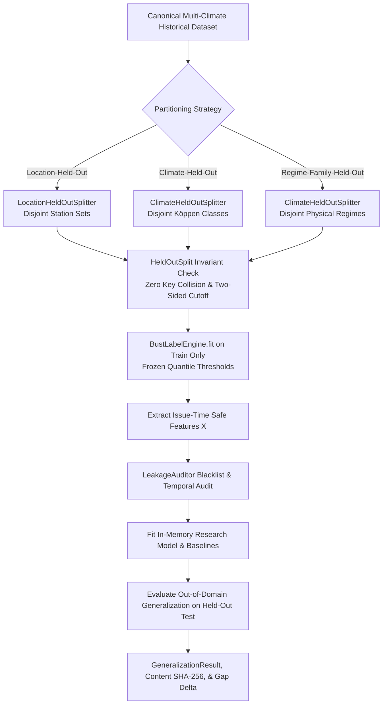

# Veyra — Phase 2 Day 11: Generalization Evaluation Report

**Document**: Scientific Generalization & Transfer Evaluation Framework (Hardened Standard)
**Scope**: Location-Held-Out, Climate-Held-Out, & Meteorological-Regime-Held-Out Evaluation Protocols
**Author**: Builder 2 (Meteorological Risk & Machine Learning Intelligence)
**Status**: ACTIVE SCIENTIFIC STANDARD

---

## 1. Executive Summary & Core Research Question

Veyra is an operational AI system designed to answer:
> *"Know When Forecasts May Fail"*

In meteorological forecasting and risk prediction, claiming "multi-location support" without rigorous out-of-domain evaluation is scientifically invalid. Models evaluated on randomly partitioned rows can easily memorize local microclimatic station biases or exploit temporal autocorrelation across adjacent forecast lead times.

Day 11 establishes Veyra's **generalization evaluation architecture**, introducing three leakage-safe evaluation protocols:
1. **Location-Held-Out Evaluation (LOLO)**: Holding out entire geographic stations from model training to measure spatial transfer.
2. **Köppen Climate Zone Holdout (LOCO)**: Holding out discrete Köppen climate classifications (e.g., `Am/Aw`, `Cwa`, `Aw`).
3. **Meteorological Regime Family Holdout**: Holding out broad atmospheric regime families (e.g., all `Semi-Arid` stations, all `Himalayan Mountain` stations, or all `Tropical Coastal` stations) across multiple geographic locations simultaneously.

---

## 2. Why Random Train/Test Splitting is Insufficient

In atmospheric time-series and NWP post-processing, standard random $k$-fold cross-validation or uniform row splitting causes severe **optimistic evaluation bias**:
- **Spatial Autocorrelation**: Stations located in the same geographic basin share local synoptic forcing. If row $t$ from Delhi is in training and row $t+6\text{h}$ from Delhi is in testing, the model merely memorizes the station bias rather than learning physical forecast instability.
- **Temporal Group Overlap**: Numerical Weather Prediction (NWP) models (such as NOAA GEFS) are initialized in discrete cycles (00Z, 06Z, 12Z, 18Z) with forecast trajectories spanning up to 16 days. Overlapping trajectories predicting identical valid periods create severe identity leakage if partitioned randomly.
- **Microclimate Memorization**: An unconstrained decision tree can split on static spatial features (e.g., elevation or station coordinates) to isolate individual cities, acting as a lookup table rather than an instability detector.

To prevent this, Veyra mandates **group-aware, spatial-held-out, climate-held-out, and two-sided temporal partitioning**.

---

## 3. Generalization Protocols

### 3.1. Location-Held-Out Protocol (`LocationHeldOutSplitter`)
- **Protocol**: One or more geographic locations $L_{\text{test}} \subset \mathcal{L}$ are held out entirely from the training partition:
  $$\mathcal{L}_{\text{train}} \cap \mathcal{L}_{\text{test}} = \emptyset$$
- **Two-Sided Temporal Precedence**:
  $$\max(\text{issue\_time}_{\text{train}}) \le t_{\text{cutoff}} \quad \text{AND} \quad \min(\text{issue\_time}_{\text{test}}) > t_{\text{cutoff}}$$
  Pre-cutoff test records are eliminated, guaranteeing both spatial out-of-domain and future out-of-time evaluation.

### 3.2. Köppen-Class vs. Meteorological-Regime Holdouts (`ClimateHeldOutSplitter`)
- **Köppen-Class Holdout**: Evaluates transfer across specific Köppen climate codes (`climate_zone`).
- **Meteorological-Regime Family Holdout**: Matches broad synoptic regime families (e.g. `match_mode="contains"`, `held_out_regimes=["Semi-Arid"]`), holding out *all* semi-arid stations across India (e.g. Delhi + Jaipur) to prevent cross-station regime leakage.

---

## 4. Strict Anti-Leakage Safeguards

Veyra enforces six levels of mathematical and data-engineering isolation:
1. **Zero Location / Climate Overlap**: Enforced via `HeldOutSplit.validate_invariants()`.
2. **Zero Forecast Identity Collisions**: Asserted on `(location_id, variable, issue_time_utc, valid_time_utc)`.
3. **Verifiable Label Provenance**: `BustLabelEngine` fits conditional quantile error thresholds $\tau(q)$ strictly on $D_{\text{train}}$. Pre-computed labels without verifiable provenance are rejected with `ValueError`.
4. **Issue-Time Feature Filtering**: `CANONICAL_FEATURE_COLUMNS` are audited by `LeakageAuditor.audit_feature_names()`. Ground truth (`truth_value`), forecast error (`forecast_error`, `forecast_abs_error`), and target labels (`bust_label`) are strictly blacklisted from $X$.
5. **Two-Sided Temporal Precedence**: Eliminates pre-cutoff test records.
6. **Dataset-Content SHA-256 Provenance**: Hashes the sorted float64 numerical data matrices of train and test partitions (`train_content_sha256`, `test_content_sha256`) to ensure bit-for-bit dataset verification.

---

## 5. Evaluation Metrics & Scientific Utility

Generalization performance is evaluated across three complementary dimensions:

### 5.1. Classification Performance
- **ROC-AUC**: Discriminative ability across all possible risk thresholds (handles single-class folds gracefully).
- **PR-AUC (Average Precision)**: Critical metric under class imbalance (forecast busts are rare tail events $\approx 5\text{–}15\%$).
- **Precision, Recall, F1 Score**: Operating point performance at binary threshold $\tau = 0.5$.

### 5.2. Probabilistic Calibration Quality
- **Brier Score**: Proper scoring rule measuring probability accuracy:
  $$\text{Brier} = \frac{1}{N} \sum_{i=1}^N (y_i - \hat{p}_i)^2$$
- **Expected Calibration Error (ECE)**: Bin-weighted discrepancy between confidence and empirical bust frequency across 5 reliability bins.

### 5.3. Operational Decision Utility
- **High-Risk Precision**: Precision when the model issues a high-risk alert ($P > 0.66$).
- **False Reassurance Rate (FRR)**: Frequency of unpredicted busts when model indicates low risk ($P < 0.33$). Minimizing FRR is critical for high-stakes infrastructure protection.
- **Ambiguous Region Fraction**: Proportion of predictions in the uncertain zone $0.40 \le P \le 0.60$.

---

## 6. Comparative Baselines

Every generalization run compares model performance against four established baselines fitted strictly on $(X_{\text{train}}, y_{\text{train}})$:
1. **Majority-Class Baseline**: Predicts non-bust ($P=0.0$).
2. **Climatology Baseline (E0)**: Predicts training-set empirical bust frequency ($\bar{y}_{\text{train}}$).
3. **Persistence Baseline (E1)**: Maps 24h inter-cycle forecast revisions ($|\Delta f_{24\text{h}}|$) to probability via training-fitted logistic regression.
4. **Spread Heuristic Baseline**: Logistic model fit strictly on raw ensemble standard deviation (`ensemble_std`).

---

## 7. Defining Strong vs. Weak Generalization

| Generalization Metric | Strong Generalization (Target) | Moderate Generalization | Degraded / Failed Transfer |
|---|---|---|---|
| **Brier Score Delta ($\Delta \text{Brier} = \text{Brier}_{\text{test}} - \text{Brier}_{\text{train}}$)** | $\le +0.05$ | $+0.05 \text{ to } +0.15$ | $> +0.15$ |
| **PR-AUC Retention ($\text{PR-AUC}_{\text{test}} / \text{PR-AUC}_{\text{train}}$)** | $\ge 80\%$ | $50\% \text{ to } 80\%$ | $< 50\%$ |
| **False Reassurance Rate** | $\le \text{Base Rate} / 2$ | $\le \text{Base Rate}$ | $> \text{Base Rate}$ |
| **High-Risk Lift over Climatology** | $\ge 2.0\times$ | $1.2\times \text{ to } 2.0\times$ | $\le 1.0\times$ |

---

## 8. Limitations & Roadmap

### Known Limitations of Current Dataset Archive:
- **Sample Size in Small Pilot Archive**: Evaluating complex nonlinear models on small rolling test slices leads to high variance in single-station out-of-domain folds.
- **Multi-Year Archive Requirement**: True statistical convergence of out-of-climate generalization across all 8 Köppen regimes requires multi-year historical archives across Indian monsoon transitions (scheduled in Day 12).

### Implications for Phase 2 Modeling:
- Models that rely heavily on coordinate lookup will fail the LOLO/LOCO evaluations and must be penalized during model selection.
- Features capturing scale-invariant atmospheric instability (e.g., ensemble spread-to-IQR ratio, multi-cycle forecast divergence, normalized pressure gradient) will be favored over location-specific absolute value memorization.
